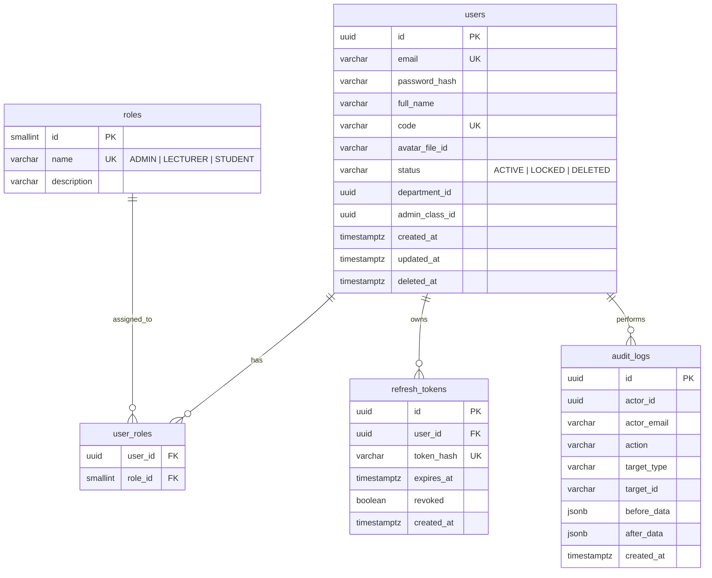
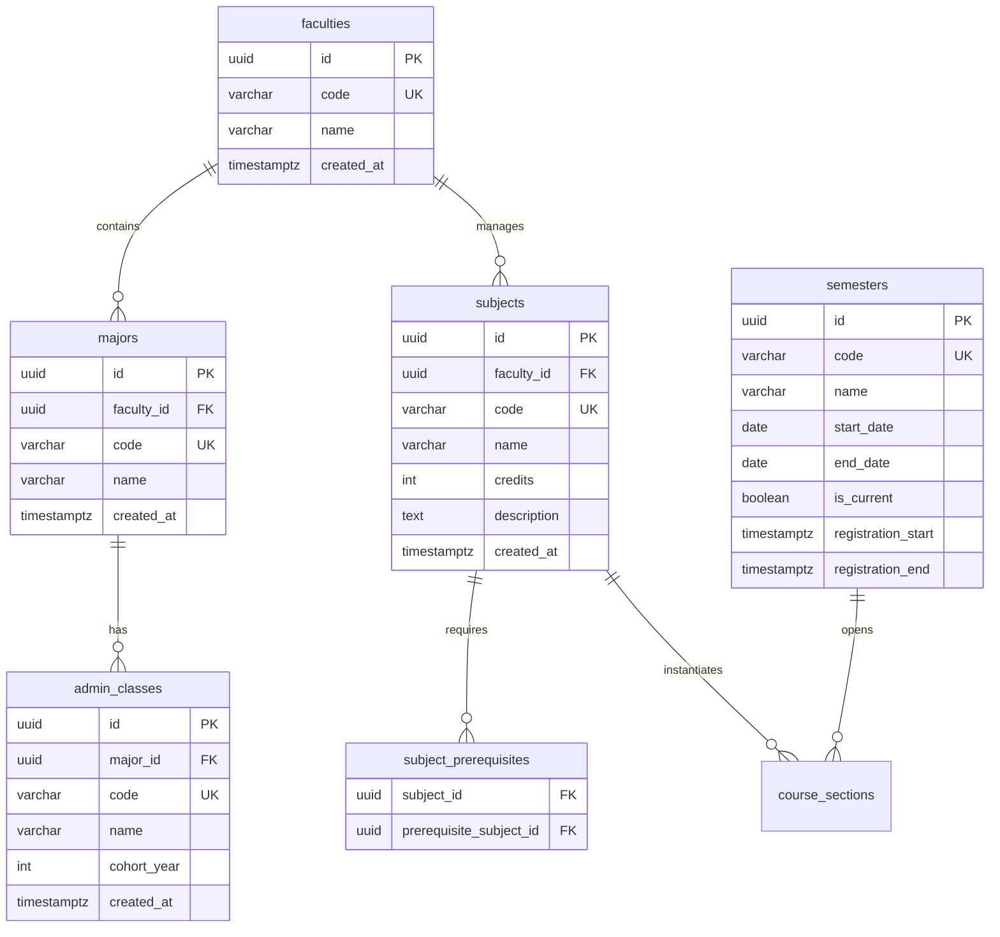

# ERD Sprint 1: `identity_db` & `academic_db`

## 1. `identity_db` (`identity-service`)

```mermaid
erDiagram
    users ||--o{ user_roles : has
    roles ||--o{ user_roles : assigned_to
    users ||--o{ refresh_tokens : owns
    users ||--o{ audit_logs : performs

    users {
        uuid id PK
        varchar email UK
        varchar password_hash
        varchar full_name
        varchar code UK
        varchar avatar_file_id
        varchar status "ACTIVE | LOCKED | DELETED"
        uuid department_id
        uuid admin_class_id
        timestamptz created_at
        timestamptz updated_at
        timestamptz deleted_at
    }

    roles {
        smallint id PK
        varchar name UK "ADMIN | LECTURER | STUDENT"
        varchar description
    }

    user_roles {
        uuid user_id FK
        smallint role_id FK
    }

    refresh_tokens {
        uuid id PK
        uuid user_id FK
        varchar token_hash UK
        timestamptz expires_at
        boolean revoked
        timestamptz created_at
    }

    audit_logs {
        uuid id PK
        uuid actor_id
        varchar actor_email
        varchar action
        varchar target_type
        varchar target_id
        jsonb before_data
        jsonb after_data
        timestamptz created_at
    }
```

## 2. `academic_db` (`academic-service`)

```mermaid
erDiagram
    faculties ||--o{ majors : contains
    majors ||--o{ admin_classes : has
    faculties ||--o{ subjects : manages
    subjects ||--o{ subject_prerequisites : requires
    semesters ||--o{ course_sections : opens
    subjects ||--o{ course_sections : instantiates

    faculties {
        uuid id PK
        varchar code UK
        varchar name
        timestamptz created_at
    }

    majors {
        uuid id PK
        uuid faculty_id FK
        varchar code UK
        varchar name
        timestamptz created_at
    }

    admin_classes {
        uuid id PK
        uuid major_id FK
        varchar code UK
        varchar name
        int cohort_year
        timestamptz created_at
    }

    semesters {
        uuid id PK
        varchar code UK
        varchar name
        date start_date
        date end_date
        boolean is_current
        timestamptz registration_start
        timestamptz registration_end
    }

    subjects {
        uuid id PK
        uuid faculty_id FK
        varchar code UK
        varchar name
        int credits
        text description
        timestamptz created_at
    }

    subject_prerequisites {
        uuid subject_id FK
        uuid prerequisite_subject_id FK
    }
```
